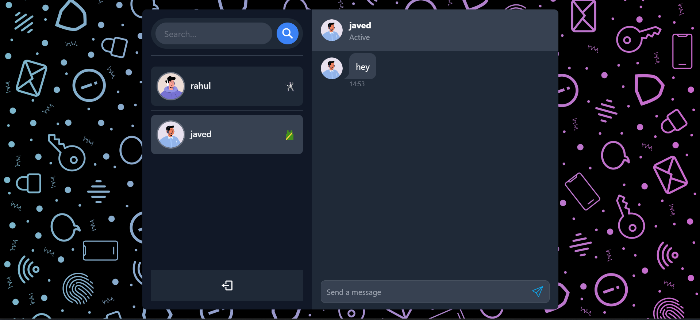

# MERN Stack Project: Real-Time Chat Application with MERN,Socket.io, Redis, Kafka And JWT 



Some Features:

- Tech Stack: MERN (MongoDB, Express, React, Node.js) + Socket.io + TailwindCSS + Daisy UI + Kafka (from Aiven) + Redis (from Render)
- Real-time Messaging: Powered by Socket.io
- Online User Status: Implemented using Socket.io and React Context
- State Management: Global state management with Zustand
- Error Handling: Comprehensive error handling on both server and client sides
- Deployment: Deployed on render platform
- And Much More!

### Setup .env file

```js
PORT=...
MONGO_DB_URI=...
JWT_SECRET=...
KAFKA_PASSWORD=...
KAFKA_USERNAME=....
REDIS_URL=...
```

### Build the app

```shell
npm run build
```

### Start the app

```shell
npm start
```
